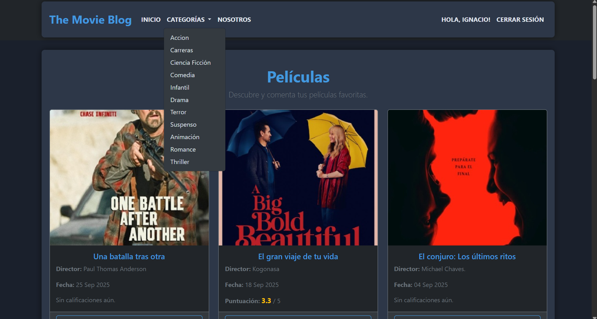

# The Movie Blog
Somos un blog de películas dedicado a compartir reseñas, trailers y noticias del mundo cinematográfico. Nuestro objetivo es ofrecerte las mejores recomendaciones y mantenerte al tanto de las últimas novedades.

Creemos que el cine es una forma de arte poderosa que une a las personas y nos permite explorar diferentes mundos e historias. Con nuestra dedicación, esperamos mejorar tu experiencia cinematográfica.

## Link del Blog

Si quieres acceder al blog usa este [link!](https://helloigna.pythonanywhere.com/)

## Desarrolladores
- [Daiana Anabel Blanco](https://github.com/DaiianaB)
- [Gabriel Maximiliano Romero](https://github.com/Gabymax7)
- [Gonzalo Sebastián Paniagua](https://github.com/Gabymax7)
- [Ignacio Valentín Ojeda](https://github.com/Helloigna20)
- [Romina Noemí Gimenez](https://github.com/Roming333)
- [Sahid Nahuel Esquivel Altamirano](https://github.com/Sahid-cyber)

## Screenshots

## Aprendizajes

Entre todos aprendimos a trabajar en equipo y poder desarrollar este blog, una grata experiencia con el acompañamiento de los profes del informatorio de Chaco, durante la etapa 2.
Esperemos disfruten este blog ❤️.

## Contacto

Nos pueden contactar via [este mail](gonzapani045@gmail.com)